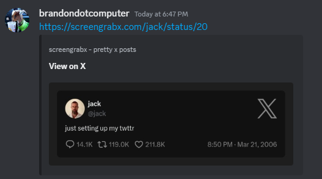

# screengrabber

A simple way to embed pretty summaries of X posts in Discord.

Just switch any `x.com` link to `screengrabx.com` and the preview will appear like this:

## To-do

- [ ] Add support for images
- [ ] Add a caching system for images. CF Worker? MongoDB?
- [ ] Create own version of X API to fetch tweets instead of relying on vxtwitter
- [ ] BUG: Long tweets have their tweet_text truncated
- [ ] Add a prettier README.md
- [ ] More tests
  - [ ] Update workflow for deployment to abort if tests fail
- [ ] Add support for other platforms like Bluesky, Mastodon, etc
- [ ] Look into some form of (anonymous) analytics for perfomance and usage metrics
- [ ] Add support for other messaging clients like Slack, Telegram, Whatsapp, etc
- [ ] BUG: Discord does heavy compression on our jpg. Maybe try png instead? Or boost width from 600 - maybe 1200?
- [ ] Set up alerts for server overload, high S3 costs, etc
